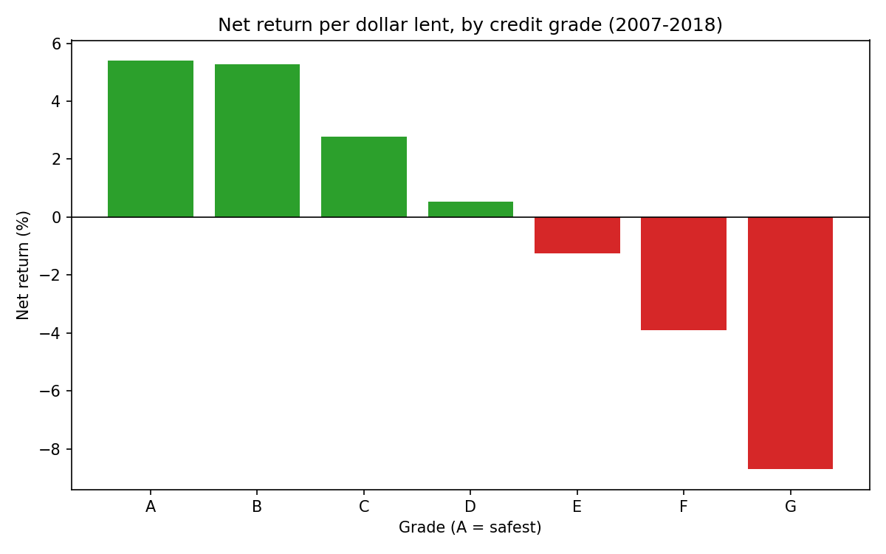

# Is loan pricing keeping up with default risk?

A SQL project I built to practice answering a lending business question end to
end: are riskier borrowers being charged enough interest to cover their
losses, and where should a lender tighten or expand?

The data is 1.35M completed LendingClub loans from 2007-2018, about $18.5B in
funded principal, loaded into Snowflake.

**Short answer: NO!** Net return per dollar lent falls from +5.4% for grade A
to -8.7% for grade G. Every grade below D lost money even at interest rates
near 28%. Exiting the unprofitable segments (16% of volume, $78M in losses)
would have lifted portfolio return from 3.1% to 4.2%.

Full writeup with the recommendation and caveats: [memo.md](memo.md)

## How it works

Data comes from the [LendingClub accepted loans dataset](https://www.kaggle.com/datasets/wordsforthewise/lending-club)
on Kaggle. I trimmed the raw csv from 151 columns down to the 15 I needed,
loaded it into Snowflake, and did everything else in SQL.

The queries in `sql/` run in order:

- `00_load_clean.sql` - builds a clean table (completed loans only, typed columns)
- `01_default_rates.sql` - default and loss rates by grade
- `02_pricing_vs_risk.sql` - net return per dollar lent by grade
- `03_segment_profitability.sql` - worst segments by grade x purpose x income quartile
- `04_impact_sizing.sql` - what exiting the losing segments would be worth
- `05_defaults_by_year.sql` - checks the losses aren't just from the 2008 era

`charts/chart.py` makes the chart from the query 02 results.

## Things I'd add with more time

- Annualize returns instead of using life-of-loan, so 36 and 60 month terms
  compare better.
- Bring in FICO and credit utilization, which the trimmed dataset leaves out
- Test whether a purpose-based pricing adjustment fixes the losing C segments